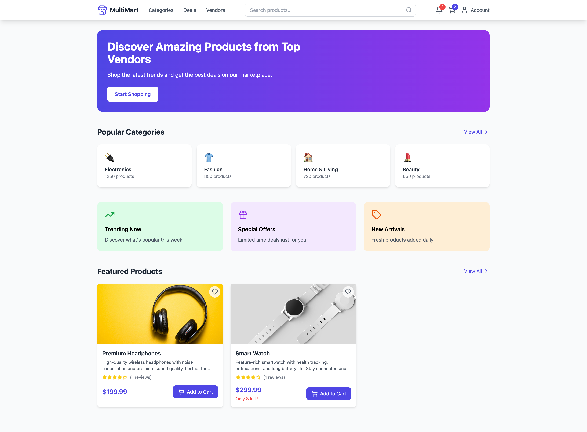
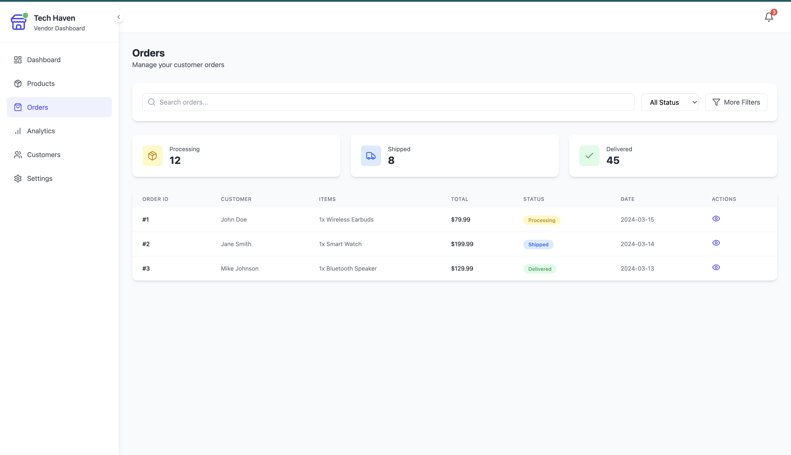

# MultiMart - Multi-Vendor E-commerce Platform


## Overview

MultiMart is a modern multi-vendor e-commerce platform built with React, TypeScript, and Tailwind CSS. It provides a seamless experience for customers to shop from multiple vendors and for vendors to manage their stores through a professional dashboard.

## Features

### For Customers
- 🛍️ Browse products from multiple vendors
- 🔍 Advanced search and filtering
- 🛒 Shopping cart functionality
- 💳 Secure checkout process
- 📱 Responsive design for all devices

### For Vendors
- 📊 Professional dashboard
- 📦 Product management
- 📋 Order tracking
- 📈 Analytics and reporting
- ⚙️ Store customization

### For Admins
- 👥 Vendor management
- 🏪 Store approvals
- 💰 Commission tracking
- 📊 Platform analytics

## Tech Stack

- **Frontend**: React 18, TypeScript
- **Styling**: Tailwind CSS
- **State Management**: React Context
- **Routing**: React Router 6
- **Animations**: Framer Motion
- **Icons**: Lucide React
- **Backend**: Supabase
- **Authentication**: Supabase Auth

## Screenshots

### Customer Interface

#### Home Page

*Modern and intuitive home page with featured products and categories*

#### Product Listing

*Grid layout with advanced filtering options*

### Vendor Dashboard

#### Vendors Overview

*Professional view with key metrics*

#### Vendors Dashbord

*Professional view Vendor Dashbord with key metrics*

#### Vendors Products

*Professional view Vendor Products with key metrics*


#### Vendors Orders

*Professional view Vendor Orders with key metrics*

#### Vendors Analytics

*Professional view Vendor Dashbord Analytics with key metrics*


## Getting Started

### Prerequisites
- Node.js 18+
- npm or yarn

### Installation

1. Clone the repository
```bash
git clone https://github.com/your-username/multimart.git
cd multimart
```

2. Install dependencies
```bash
npm install
```

3. Start the development server
```bash
npm run dev
```

### Test Accounts

For testing purposes, you can use these credentials:

#### Customer Account
- Email: customer@test.com
- Password: test123

#### Vendor Account
- Email: vendor@test.com
- Password: test123

#### Admin Account
- Email: admin@test.com
- Password: test123

## Project Structure

```
src/
├── components/         # Reusable components
│   ├── ProductCard
│   └── vendor/        # Vendor dashboard components
├── pages/             # Page components
│   ├── auth/          # Authentication pages
│   └── vendor/        # Vendor dashboard pages
├── types/             # TypeScript interfaces
├── config/            # Configuration files
└── App.tsx            # Main application component
```

## Key Features in Detail

### Vendor Dashboard
- **Analytics**: Real-time sales and performance metrics
- **Order Management**: Track and process orders efficiently
- **Inventory Control**: Manage product stock levels
- **Customer Insights**: View customer behavior and preferences

### Customer Features
- **Smart Search**: Advanced product search with filters
- **Secure Checkout**: Multiple payment options
- **Order Tracking**: Real-time order status updates
- **Wishlist**: Save products for later

### Admin Controls
- **Vendor Management**: Approve and manage vendors
- **Analytics Dashboard**: Platform-wide performance metrics
- **Commission Management**: Set and track vendor commissions

## Contributing

1. Fork the repository
2. Create your feature branch (`git checkout -b feature/AmazingFeature`)
3. Commit your changes (`git commit -m 'Add some AmazingFeature'`)
4. Push to the branch (`git push origin feature/AmazingFeature`)
5. Open a Pull Request

## License

This project is licensed under the MIT License - see the [LICENSE](LICENSE) file for details.

## Acknowledgments

- Icons by [Lucide React](https://lucide.dev)
- UI inspiration from modern e-commerce platforms
- Stock photos from [Unsplash](https://unsplash.com)